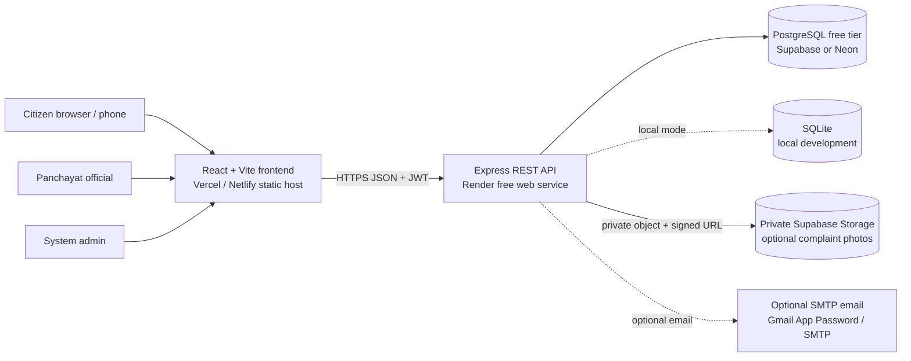
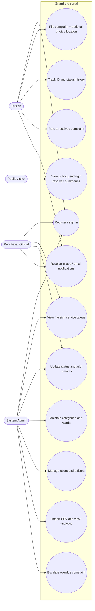
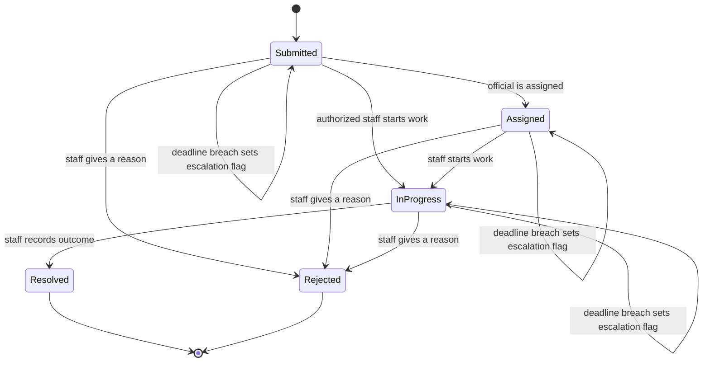

# Architecture and API Reference

## System context



The browser never connects directly to PostgreSQL or Storage with a service key. The frontend sends relative `/api` calls during Vite development, or uses `VITE_API_URL` in production. Express validates and authorizes every protected request. `DATABASE_URL` selects PostgreSQL; when it is absent, `better-sqlite3` opens SQLite for local development.

## Use-case diagram



## Complaint state machine



`Escalated` is an event/priority flag, not an extra status, so the required status vocabulary stays intact. An auto-escalation never pretends a complaint was resolved.

## Entity relationship diagram

```mermaid
erDiagram
  USERS {
    text id PK
    text full_name
    text email UK
    text phone
    text password_hash
    text role
    text ward_id
    int is_active
    text created_at
  }
  CATEGORIES {
    text id PK
    text name_en UK
    text name_kn
    int sla_days
    text color
  }
  WARDS {
    text id PK
    text name_en UK
    text name_kn
  }
  COMPLAINTS {
    text id PK
    text reference_id UK
    text citizen_id FK
    text category_id FK
    text ward_id FK
    text assigned_officer_id FK
    text title
    text description
    text public_summary
    text location_text
    text latitude
    text longitude
    text photo_url_or_storage_path
    text status
    text priority
    text resolution_deadline
    text resolved_at
    text escalated_at
    int is_public
    int is_deleted
    text source
    text created_at
    text updated_at
  }
  COMPLAINT_EVENTS {
    text id PK
    text complaint_id FK
    text actor_id FK
    text event_type
    text old_status
    text new_status
    text remarks
    text created_at
  }
  NOTIFICATIONS {
    text id PK
    text user_id FK
    text complaint_id FK
    text title_en
    text message_en
    text title_kn
    text message_kn
    text read_at
    text created_at
  }
  FEEDBACK {
    text id PK
    text complaint_id FK_UK
    text citizen_id FK
    int rating
    text comment
    text created_at
  }
  USERS ||--o{ COMPLAINTS : submits
  USERS o|--o{ COMPLAINTS : assigned_to
  CATEGORIES ||--o{ COMPLAINTS : classifies
  WARDS ||--o{ COMPLAINTS : locates
  COMPLAINTS ||--o{ COMPLAINT_EVENTS : records
  USERS o|--o{ COMPLAINT_EVENTS : acts
  USERS ||--o{ NOTIFICATIONS : receives
  COMPLAINTS o|--o{ NOTIFICATIONS : about
  COMPLAINTS ||--o| FEEDBACK : receives
  USERS ||--o{ FEEDBACK : rates
  WARDS o|--o{ USERS : default_ward
```

### Data and privacy decisions

- IDs are UUID strings; `reference_id` is a separate citizen-facing, unique `GS-YY-NNNNNN` code.
- `description`, coordinates, citizen name, email and phone are private fields. Public endpoints select only reference, category, ward, status, dates and the citizen-supplied `public_summary`; a common phone/email redactor is a second safety measure, not a substitute for consent/review.
- Photo objects live in a private Supabase bucket. The database stores an internal `supabase://bucket/path`; the API returns a one-hour signed URL only when an authorized complaint detail is fetched. Local photos are for development only.
- Imported sample records have `citizen_id = NULL`; they cannot impersonate a portal user. `source` distinguishes portal, synthetic seed and CSV-import records.
- Category/ward deletion is refused when referenced. User deletion is a soft disable to preserve complaint history. A citizen may edit or withdraw only an unassigned `Submitted` complaint; admin archive and citizen withdrawal set `is_deleted` rather than physically erasing history. Complaint events are append-only from the normal UI.
- Passwords are bcrypt hashes. JWT expiry is 12 hours. Roles are `citizen`, `official`, and `admin`.

## Role permissions

| Capability | Citizen | Official | Admin | Public visitor |
|---|---:|---:|---:|---:|
| Register / login | Yes | Seed/admin-provisioned | Seed/admin-provisioned | No |
| File complaint / attach photo | Own | No | No | No |
| Edit/withdraw complaint | Own, while Submitted and unassigned | No | Archive any | No |
| Read complaint detail | Own only | Assigned-to-self + unassigned queue | All | Redacted tracking only |
| Assign official / change status | No | Queue items visible to that official | All complaints | No |
| Submit feedback | Own resolved complaint | No | No | No |
| CRUD categories / wards / users | No | No | Yes | No |
| CSV import / analytics | Own analytics | Queue analytics | All analytics / import | Aggregate + public summaries |
| Public transparency page | Yes | Yes | Yes | Yes |

An official can work only on a complaint assigned to them or not yet assigned. The admin can reassign any open complaint. A future production deployment should add jurisdiction scoping, fine-grained audit review and stronger account provisioning.

## REST API list

All routes are prefixed by `/api`. Protected routes require `Authorization: Bearer <JWT>`. Errors use `{ "error": "...", "details": [...] }` where applicable. API validation is server-side; UI checks improve feedback but are not trusted.

| Method + route | Access | Purpose |
|---|---|---|
| `GET /health` | Public | API/database readiness. |
| `POST /auth/register` | Public | Create a citizen account only; role is never client-selectable. |
| `POST /auth/login` | Public, rate-limited | Verify bcrypt password and return a 12-hour JWT. |
| `GET /auth/me` | Any signed-in user | Current account profile. |
| `GET /categories` | Public | Bilingual category list and SLA. |
| `POST /categories` | Admin | Create category. |
| `PUT /categories/:id` | Admin | Update category. |
| `DELETE /categories/:id` | Admin | Delete only when unused. |
| `GET /wards` | Public | Bilingual ward list. |
| `POST /wards` | Admin | Create ward. |
| `PUT /wards/:id` | Admin | Update ward. |
| `DELETE /wards/:id` | Admin | Delete only when unused. |
| `GET /officers` | Official, admin | List officers for assignment. |
| `GET /users` | Admin | List users without password hashes. |
| `POST /users` | Admin | Provision citizen / official / admin account. |
| `PUT /users/:id` | Admin | Update profile, role, ward, active flag; optional password reset. |
| `DELETE /users/:id` | Admin | Soft-disable account. |
| `GET /complaints?q=&status=&categoryId=&wardId=&limit=` | Any signed-in user | Role-scoped queue/list. |
| `POST /complaints` | Citizen | Multipart complaint with optional `photo`; 5 MB image limit. |
| `PUT /complaints/:id-or-reference` | Owning citizen | Edit category, ward, content, visibility, location or optional photo while still unassigned and Submitted. |
| `DELETE /complaints/:id-or-reference` | Owning citizen (unassigned Submitted) or admin | Soft-withdraw/archive from active and public views; keep the audit record. |
| `GET /complaints/:id-or-reference` | Owner, eligible official, admin | Authorized detail, event timeline and optional signed image URL. |
| `PATCH /complaints/:id-or-reference/assign` | Official, admin | Assign an active complaint and record remarks. |
| `PATCH /complaints/:id-or-reference/status` | Official, admin | Transition status with a required remark. |
| `POST /complaints/:id-or-reference/feedback` | Owning citizen | One 1–5 rating and optional comment after resolution. |
| `GET /notifications?limit=` | Any signed-in user | Current user's bilingual notifications and unread count. |
| `PATCH /notifications/:id/read` | Owner | Mark one notification read. |
| `PATCH /notifications/read-all` | Owner | Mark all current user's notifications read. |
| `GET /analytics` | Signed-in user | Scoped totals, statuses, category/ward/month trends, resolution hours, escalations and feedback. |
| `GET /public/transparency?group=&status=&q=` | Public | Redacted public list and aggregate counts. |
| `GET /public/track/:reference` | Public | Redacted status lookup by reference ID. |
| `POST /admin/import-csv` | Admin | Import up to 1,000 CSV records (1 MB); unknown category/ward or invalid rows are skipped with row errors. |

### Main request examples

```json
POST /api/auth/login
{ "email": "citizen@example.com", "password": "a-long-password" }
```

```json
PATCH /api/complaints/GS-26-123456/status
{ "status": "In Progress", "remarks": "Site inspection completed; work scheduled." }
```

CSV header aliases: `category_id` or `category`, `ward_id` or `ward`, `title` or `subject`, plus `description`. Optional: `reference_id`, `public_summary`, `status`, `location_text`/`location`, `created_at`, `resolved_at`, `resolution_deadline`, and `officer_email`.
